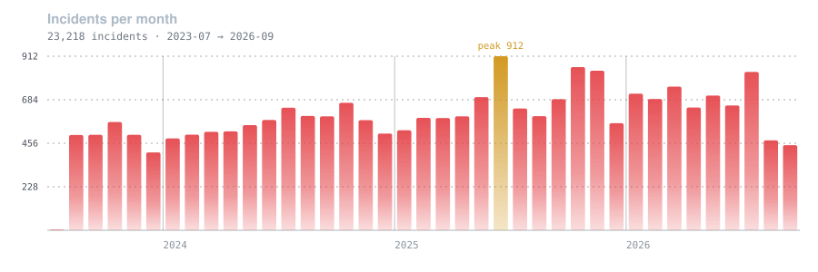
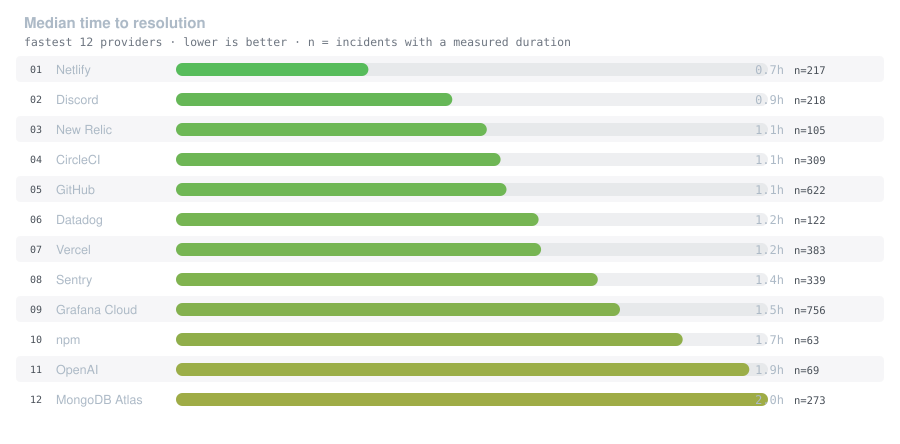
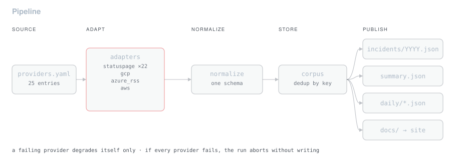

<div align="center">


# Cloud Incident Atlas

**Every major vendor publishes a status page. None publish them side by side.**
22,284 incidents from 25 providers, normalized into one schema and updated six days a week.


[](https://ayushgupta07xx.github.io/cloud-incident-atlas/)
[](https://ayushgupta07xx.github.io/cloud-incident-atlas/providers/)


[](https://github.com/ayushgupta07xx/cloud-incident-atlas/commits/main)

[**Live dataset →**](https://ayushgupta07xx.github.io/cloud-incident-atlas/) · [Providers](https://ayushgupta07xx.github.io/cloud-incident-atlas/providers/) · [Methodology](https://ayushgupta07xx.github.io/cloud-incident-atlas/methodology/)

<br>



</div>

---

<!-- STATUS:START -->

**Last ingest** &nbsp;`2026-08-21 08:08 UTC` &nbsp;·&nbsp; **24 new** and **5 updated** incidents &nbsp;·&nbsp; 22,617 total

| Provider | Incidents |
| --- | ---: |
| Cloudflare | 8 |
| Twilio | 6 |
| Elastic Cloud | 3 |
| OpenAI | 2 |
| Amazon Web Services | 2 |
| Supabase | 2 |

Most severe this run:

- `critical` **GitHub** — Intermittent failures creating agent tasks
- `high` **Google Cloud Platform** — We are investigating an issue where customers may experience timeouts, service degradati
- `major` **Snowflake** — INC20000168

<!-- STATUS:END -->

If you run on three clouds and six SaaS dependencies, *"is this vendor reliable?"*
is answerable only by opening nine separate status pages and scrolling. Each one
has its own schema, its own severity words, its own idea of a timestamp. None of
them let you compare.

This ingests 25 of them daily, normalizes everything onto one schema, and computes
MTTR, incident frequency and severity distribution you can actually put next to
each other.

## Reliability, measured

<div align="center">

</div>

22,131 of 22,284 incidents carry both a start and a resolution, which is what makes
duration derivable. Percentiles are suppressed below n=10 and medians below n=5 —
a p90 over four samples is the maximum wearing a suit, and publishing it beside a
p90 over fifty implies a comparability that is not there.

| Provider | Category | Incidents | Median MTTR | p90 |
|---|---|---:|---:|---:|
| Twilio | `comms` | 10,660 | 4.5h | 17.6h |
| Cloudflare | `cdn` | 6,559 | 4.0h | 8.2h |
| Grafana Cloud | `observability` | 726 | 1.5h | 19.2h |
| GitHub | `devtools` | 586 | 1.1h | 4.7h |
| DigitalOcean | `cloud` | 494 | 2.4h | 9.5h |
| Supabase | `paas` | 375 | 2.6h | 13.4h |
| Vercel | `paas` | 372 | 1.2h | 6.1h |
| Sentry | `observability` | 324 | 1.4h | 6.0h |
| CircleCI | `devtools` | 295 | 1.1h | 8.2h |
| MongoDB Atlas | `data` | 265 | 2.0h | 23.1h |
| Confluent Cloud | `data` | 248 | 3.3h | 27.4h |
| Elastic Cloud | `observability` | 241 | 3.1h | 22.1h |

*Full table for all 24 providers with data: [providers page](https://ayushgupta07xx.github.io/cloud-incident-atlas/providers/).*

| Category | Providers | Incidents | Major or worse |
|---|---:|---:|---:|
| `comms` | 3 | 10,995 | 106 |
| `cdn` | 1 | 6,559 | 129 |
| `observability` | 5 | 1,512 | 532 |
| `devtools` | 5 | 1,004 | 202 |
| `paas` | 3 | 959 | 213 |
| `data` | 3 | 696 | 241 |
| `cloud` | 3 | 534 | 30 |
| `ai` | 1 | 25 | 6 |

## How it works

<div align="center">

</div>

22 of 25 providers run Atlassian Statuspage, which exposes a uniform v2 JSON API —
so one adapter covers most of the surface and the bespoke feeds get their own.
**Adding a provider is a one-line change to `providers.yaml`.**

**Provider failures are isolated.** A vendor that changes its feed shape or goes
down degrades that provider only; it does not fail the run. If *every* provider
fails, the run aborts without writing, so a network partition cannot truncate the
corpus.

**The v2 API caps at 50 incidents.** `/history.json` pages by month and shares the
same id space, so `backfill.py` extends the corpus back to 2019 without
duplicating anything the daily run already holds. That endpoint has a poorer
schema — no ISO timestamps, no components — so dates are parsed from display
strings. Seven format variants covered 3,144 of 3,144 sampled records.
**Unparseable input yields no record rather than a guessed date.**

### Data

| Path | Contents |
|---|---|
| `data/incidents/YYYY.json` | Canonical corpus, sharded by year |
| `data/summary.json` | MTTR mean/median/p90, severity mix, category rollups |
| `data/daily/YYYY-MM-DD.json` | That day's new and changed incidents |
| `data/baseline.json` | Per-provider health baseline for drift detection |

Severity is normalized to a 0–3 ordinal across vendor vocabularies. All
timestamps are the vendor's own, converted to UTC.

## Automation

**This repository commits automatically.** A scheduled workflow
(`.github/workflows/daily-ingest.yml`) runs six days a week at varied times,
fetches every feed, and commits under my account identity when upstream data has
changed.

- Commits titled `data: ingest update (...)` are machine-generated. Each carries a
  link to the Actions run that produced it and a `Co-authored-by: github-actions[bot]` trailer.
- Every other commit is hand-written: adapters, metrics, tests, docs.
- **When no provider has published anything new, the workflow commits nothing.**
  The history tracks real upstream activity rather than a fixed heartbeat.

A provider that returns zero records for three consecutive runs after previously
returning data opens an issue automatically — silent degradation is the real
failure mode for an unattended pipeline, not a crash.

## Bugs found, and what they cost

Every one of these is covered by a regression test.

| Bug | Effect |
|---|---|
| Same-day delta overwritten | Second run erased the first run's audit trail |
| `date.today()` read local time | IST machine and UTC runners disagreed on the date before 05:30 IST |
| Incident filed under the month it **ended** | Records dated 2027-01-01 in a corpus built July 2026 |
| `strptime` `%Z` cannot resolve `PDT`/`PST` | All 36 AWS records had a null `created_at` |
| `status.zoom.us` ignores `?page` | 128 records multiplied to 1,536 |
| Health baseline stored a timestamp | Committed on quiet days, defeating the no-heartbeat rule |
| Alert label did not exist | The mechanism reporting a broken pipeline was itself broken |

## Running locally

```bash
pip install -r requirements.txt -r requirements-dev.txt

python -m src.ingest --dry-run    # fetch every feed, write nothing
python -m src.ingest              # full run
python backfill.py                # one-time historical backfill
python scripts_charts.py          # regenerate README charts from the corpus

pytest tests -q                   # 38 tests, no network
ruff check src tests
```

## Known limitations

Found and disclosed, not discovered later.

- **AWS contributes counts but no MTTR.** Its RSS emits one item per *update*
  rather than per incident, so durations require pairing issue and resolution
  items per service and region. Largest remaining data gap.
- **Azure publishes only currently-active incidents.** An empty feed means nothing
  is broken, not that collection failed. There is no public Azure historical feed,
  so it contributes almost nothing outside live outages.
- **Fastly is excluded.** Its status page returns `403 Invalid request blocked` to
  automated clients on every path. That is an intentional block and is not worked
  around.
- **Backfill depth varies by vendor.** Some expose years, some months. Providers
  with thin history show an em dash rather than a number.
- **Scheduled maintenance is counted as an incident** where a vendor files it as
  one. Severity `maintenance` and `none` both rank 0.
- **Keyword-matched category assignment.** Categories come from `providers.yaml`,
  assigned by hand. There is no taxonomy beyond what fits this set of vendors.

## Stack

**Ingest** Python 3.12 · requests · PyYAML
**Quality** pytest (38 offline tests) · ruff · CI on push and PR
**Automation** GitHub Actions — ingest, CI, Pages, drift alerting, monthly keepalive
**Site** MkDocs Material on GitHub Pages
**Storage** Year-sharded JSON in git; no database

## Repository layout

| Path | What it does |
|---|---|
| `providers.yaml` | The registry — one line per provider |
| `src/providers.py` | Adapter dispatch, normalization, severity scale |
| `src/history.py` | `/history.json` backfill, timestamp parsing |
| `src/ingest.py` | Corpus load, dedup, delta, orchestration |
| `src/metrics.py` | MTTR, percentiles, sample-size thresholds |
| `src/health.py` | Per-provider drift baseline |
| `src/site.py` | Generates the published pages |
| `scripts/charts.py` | Regenerates README charts from the corpus |
| `backfill.py` | One-time historical import |
| `tests/` | 38 offline tests over recorded fixtures |
| `RUNBOOK.md` | Diagnosis by symptom |

---

<div align="center">

*Vendor status pages are published to be read once, during an outage.*
*Kept and compared, they answer a different question entirely.*

</div>
